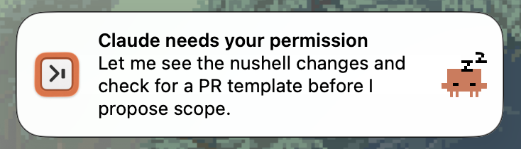

# Clawd Back

A tiny macOS app that notifies you when [Claude Code](https://docs.anthropic.com/en/docs/claude-code) needs you, and **claws you back** to the exact terminal window, tab, and (in [Zellij](https://zellij.dev/)) pane where that session is waiting when you click the notification.

It also stays quiet when you are already looking at that session, so you only get pinged when it is actually worth switching.



> Fork of [rvcas/claude-zellij-whip](https://github.com/rvcas/claude-zellij-whip) (MIT). The original focused on Zellij pane focus; this fork adds OS window/tab targeting, skip-when-viewing, a Nix flake, and some crabs.

## What it does

- **Notifies** via `UNUserNotificationCenter` on Claude's `Stop` and `Notification` hooks.
- **Remembers where the session lives.** On `SessionStart` and every `UserPromptSubmit` it records the OS window id + tab id, plus the Zellij session/pane when present, keyed by Claude session id. Each prompt re-derives the record: it re-reads what it can and drops any target that no longer resolves, so targeting stays correct after you reattach a Zellij session in a different window.
- **Skips the banner** when the front window is already that session's window (and, in Zellij, its pane).
- **Clears the banner when you come back.** Each session has one live notification, so a new one replaces that session's stale banner instead of stacking. It is removed as soon as you are seen at the session's window/pane: on that session's next prompt, or when any other session notifies while you are looking at it.
- **Clicks back.** Clicking a notification raises the saved window, selects its tab, brings the app to the front (even from another app), and in Zellij runs `action focus-pane-id`.
- **Tells you when it can't.** If the session moved out of reach since capture, a click can't land, so instead of doing nothing it posts a second notification naming the reason: the window is closed, the Zellij session is detached (with the `zellij attach` command to run), or the session is gone and was possibly renamed. That notification replaces the session's banner, so it clears the same way.
- **Cleans up** the saved state on `SessionEnd`.
- **Crabs.** Each notification shows a random Claude Crab as its image.

## Requirements

- macOS (uses `UNUserNotificationCenter` + AppKit).
- A terminal emulator, or any other app you run Claude Code from. **Ghostty** is fully supported (window + tab targeting via AppleScript). The other named terminals (`wezterm`, `iterm2`, `terminal`, `alacritty`, `kitty`, `rio`) degrade to activating the app, plus Zellij pane focus. Any other app (e.g. an editor with an embedded terminal) can be configured as `generic`, which raises its actual window via generic Accessibility scripting instead of just activating the app — see [Configuration](#configuration).
- Optional: [Zellij](https://zellij.dev/) with the built-in `action focus-pane-id`.

## Install

### Homebrew

```bash
brew tap hazel-ocean/clawd-back https://github.com/hazel-ocean/clawd-back
brew install --cask clawd-back
```

Apple Silicon, macOS 13+. The build is ad-hoc signed (not notarized), so the cask strips the download quarantine on install to keep Gatekeeper from blocking first launch. Upgrade with `brew upgrade --cask clawd-back`.

### Nix (flake)

```nix
inputs.clawd-back.url = "github:hazel-ocean/clawd-back";
```

The flake exposes `packages.default` (an `.app` under `$out/Applications`). Install it where LaunchServices can find it, for example a home-manager activation that copies it to `~/Applications`, re-signs ad-hoc, and runs `lsregister`.

### Just

```bash
git clone https://github.com/hazel-ocean/clawd-back
cd clawd-back
just install   # builds, bundles, signs, installs to ~/Applications/ClawdBack.app
```

By default the app is ad-hoc signed. To use a Developer ID: `just install signing_identity="Apple Development: You (XXXXXXXXXX)"`.

> First time you click a notification, macOS asks for permission to control Ghostty (Automation). Grant it. An ad-hoc re-sign on rebuild can reset that grant; the app still comes to the front regardless, only the tab-select needs it.
>
> **Accessibility** (System Settings → Privacy & Security → Accessibility) is a second, distinct permission, and it is worth granting for any app. It is how ClawdBack identifies the exact window your session lives in, which is what lets a claw-back cross a Space or enter a full-screen window. Without it, the window is identified from what is currently on screen, which is only reliable while the terminal is frontmost.
>
> For `application = "generic"` (see [Configuration](#configuration)) it is required rather than advisable, since raising that app's window goes through System Events. Without it, ClawdBack still activates the app via `open -b`, just without raising the specific window.

## Claude Code hooks

The app has three modes, each driven by a Claude Code hook:

| Mode      | Claude hooks                     | What it does                                              |
| --------- | -------------------------------- | -------------------------------------------------------- |
| `capture` | `SessionStart`, `UserPromptSubmit` | Save the current window/tab for this session.            |
| `notify`  | `Stop`, `Notification`           | Ping you (and stash the locator to claw you back).       |
| `cleanup` | `SessionEnd`                     | Delete this session's saved state.                       |

`capture` runs on **both** `SessionStart` (initial/attach) and `UserPromptSubmit` (every turn). The per-turn re-capture keeps targeting correct after you reattach a Zellij session in a *different* terminal window: the process never restarts so `SessionStart` never re-fires, but the next prompt refreshes the saved window/tab.

A front-window read is trusted when the terminal is frontmost, or when Zellij confirms the pane is focused, which holds while another app sits in front. Failing both, the saved window is kept only while it is still open: a window id that no longer resolves is dropped, because it makes a click give up where no window id at all still focuses the pane. The same rule drops a Zellij session that is no longer in `list-sessions`.

Claude Code delivers the hook payload (including `session_id`) as **JSON on stdin**, so each mode is fronted by a tiny wrapper that reads stdin and calls the app. **Ready-made wrappers ship inside the app bundle**, one directory per shell, at `/Applications/ClawdBack.app/Contents/Resources/hooks/<shell>/{capture,notify,cleanup}`, so point your hooks straight at them, no copy-paste.

Bash:

```json
{
  "hooks": {
    "SessionStart":     [{ "hooks": [{ "type": "command", "command": "/Applications/ClawdBack.app/Contents/Resources/hooks/bash/capture" }] }],
    "UserPromptSubmit": [{ "hooks": [{ "type": "command", "command": "/Applications/ClawdBack.app/Contents/Resources/hooks/bash/capture" }] }],
    "Stop":             [{ "hooks": [{ "type": "command", "command": "/Applications/ClawdBack.app/Contents/Resources/hooks/bash/notify" }] }],
    "Notification":     [{ "hooks": [{ "type": "command", "command": "/Applications/ClawdBack.app/Contents/Resources/hooks/bash/notify" }] }],
    "SessionEnd":       [{ "hooks": [{ "type": "command", "command": "/Applications/ClawdBack.app/Contents/Resources/hooks/bash/cleanup" }] }]
  }
}
```

Nushell (swap `bash` for `nushell`):

```json
{
  "hooks": {
    "SessionStart":     [{ "hooks": [{ "type": "command", "command": "/Applications/ClawdBack.app/Contents/Resources/hooks/nushell/capture" }] }],
    "UserPromptSubmit": [{ "hooks": [{ "type": "command", "command": "/Applications/ClawdBack.app/Contents/Resources/hooks/nushell/capture" }] }],
    "Stop":             [{ "hooks": [{ "type": "command", "command": "/Applications/ClawdBack.app/Contents/Resources/hooks/nushell/notify" }] }],
    "Notification":     [{ "hooks": [{ "type": "command", "command": "/Applications/ClawdBack.app/Contents/Resources/hooks/nushell/notify" }] }],
    "SessionEnd":       [{ "hooks": [{ "type": "command", "command": "/Applications/ClawdBack.app/Contents/Resources/hooks/nushell/cleanup" }] }]
  }
}
```

Use whatever path the app actually lives at, `~/Applications/...` if you installed there via `just install`.

> **Nix users:** the flake installs the app under `~/Applications` (a `/nix/store` path rotates on rebuild). Rather than chase the bundle path, generate your own wrappers with `pkgs.writeScript` and point the hooks at their stable `~/.claude/hooks/...` symlinks. The [`hooks/nushell/`](hooks/nushell/) scripts are a ready template.

Prefer your own copies, or a shell that isn't shipped? The same wrappers live under [`hooks/`](hooks/), one directory per shell: [`hooks/bash/`](hooks/bash/) and [`hooks/nushell/`](hooks/nushell/). Copy a set to `~/.claude/hooks/` and point the commands there instead.

The banner title states the reason: on a `Notification` it's the specific message (which tool needs permission, or idle); on `Stop` it's `Claude has finished and is waiting`. Inside Zellij it's led by the session name, `[my-project] Claude has finished and is waiting`, so a glance tells you which workspace wants you. The body always carries Claude's last message, pulled from the transcript tail, as color. The Nushell `notify` parses the transcript natively; the bash one needs `jq` for it and otherwise falls back to a generic nudge.

Because `open` propagates the caller's environment, `ZELLIJ_SESSION_NAME` / `ZELLIJ_PANE_ID` reach the app when the hook runs inside a Zellij pane.

### Customizing the notification

`--title` and `--message` are the wrapper's to compute however you like: from the hook payload, the transcript, the environment. `--session-id` and `--cwd` are what the app needs to skip-when-viewing and claw you back, so keep passing them through. Copy a wrapper to `~/.claude/hooks/`, edit it, and point the hook commands there.

## Configuration

Pick the app to claw back to in `~/.config/clawd-back/config.toml` (or `config.json`):

```toml
application = "ghostty"  # ghostty | wezterm | iterm2 | terminal | alacritty | kitty | rio | generic
```

Defaults to `ghostty` if no config exists.

For any app without an AppleScript dictionary (anything other than Ghostty
that isn't one of the named terminals above), use `generic` with its bundle
id:

```toml
application = "generic"
bundleIdentifier = "com.example.SomeApp"
```

This addresses the app's window by title via generic Accessibility scripting
rather than a stable id, so it's best-effort: it needs the Accessibility
permission above. The window is still tracked by its WindowServer id, so an
app that retitles between capture and click stays reachable.

### Cross-Space and full-screen focus

A full-screen window is its own Mission Control Space, and no public API moves
focus across a Space. ClawdBack fronts the saved window through the
WindowServer directly, which carries the screen to it. That path is verified on
Apple Silicon, macOS 14 through 26; outside that range it falls back to
activating the app, so a full-screen target is reached only if macOS happens to
switch Spaces on activation.

To try it on a macOS release it has not been verified against:

```toml
forceWindowServerRaiseEnabled = true
```

This lifts the upper bound only. The lower bound and the Apple Silicon
requirement stand.

## How it works

```
SessionStart   -->  open -gn ClawdBack.app --args capture --session-id <id>
UserPromptSubmit    saves window_id + tab_id (+ zellij session/pane)
                    to ~/.cache/clawd-back/<id>.json (dropping dead targets)
                    removes this session's delivered notification

Stop / Notify  -->  open -gn ClawdBack.app --args notify --session-id <id> ...
                    removes the notifications of every window/pane you view now
                    already viewing that window? -> skip
                    else show notification, keyed session:<id>
                    (locator in userInfo, random crab)

click          -->  open -b <terminal>   (bring to front, cross-app)
                    select saved window + tab
                    zellij: action focus-pane-id terminal_<pane>

SessionEnd     -->  open -gn ClawdBack.app --args cleanup --session-id <id>
                    removes ~/.cache/clawd-back/<id>.json
```

Targeting is by the saved OS window id captured at `SessionStart`, so it is exact regardless of what is frontmost when a notification fires. Ghostty implements window/tab capture + select via its own AppleScript dictionary; `generic` implements window capture + raise via System Events/Accessibility (title-based, best-effort); the other named terminals fall back to activating the app (+ `focus-pane-id`). Both window-addressing paths also save the WindowServer id of the window, which is what carries focus across Spaces and into a full-screen window.

Each mode is launched with `open -gn`: `-n` because `open --args` against an already-running instance delivers nothing and only activates it, and `-g` because a notifier with no window has no business taking focus.

Counters go to the unified log. Read them with `log show --last 1h --predicate 'subsystem == "com.hazel.clawd-back"'`.

## Project layout

```
Sources/
  main.swift               # mode dispatch: capture | notify | cleanup | click handler
  AppDelegate.swift        # notification click handling
  NotificationSender.swift # capture + send, crab attachment
  Dismissal.swift          # notification keying + removal once you are back
  Focus.swift              # focus plans, skip-when-viewing, click payload
  FocusFailure.swift       # unreachable target: locator notification
  Application.swift        # app protocols, window/tab targets, app selection
  Ghostty/                 # window/tab capture + focus via its AppleScript dictionary
  Accessibility/           # same, by window title via System Events (`generic`)
  WindowServer/            # cross-Space window raise via private SkyLight calls
  Counters.swift           # claw-back counters, emitted to the unified log
  Multiplexer.swift        # zellij: pane target, focus, attach/focus probes
  StateStore.swift         # ~/.cache/clawd-back/<id>.json
  Config.swift             # app-selection config (TOML/JSON)
  Shell.swift              # process + quoting helpers
Resources/
  Info.plist               # LSUIElement bundle, id com.hazel.clawd-back
  AppIcon.icns             # app icon
  AlternateAppIcons/       # icon variants
  Crabs/                   # crab images, one at random per notification
hooks/                     # hook wrappers, one dir per shell (both bundled into the app)
  bash/                    # capture | notify | cleanup
  nushell/                 # same wrappers, Nushell
Tests/
  clawd-backTests/         # pure units: plans, payloads, state, identifiers
```

## License

MIT. See [LICENSE](LICENSE).
